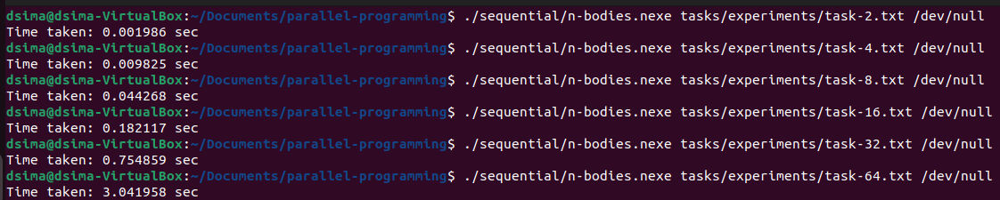
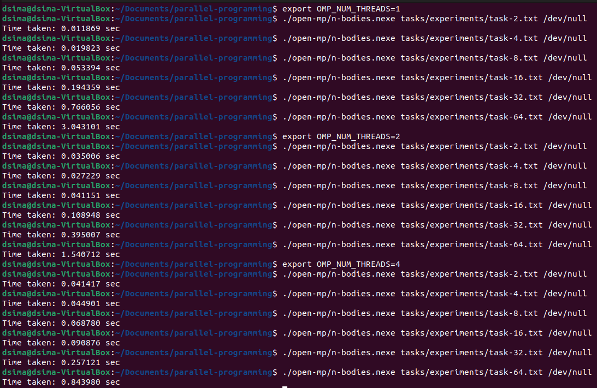
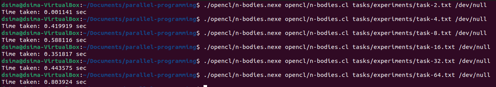
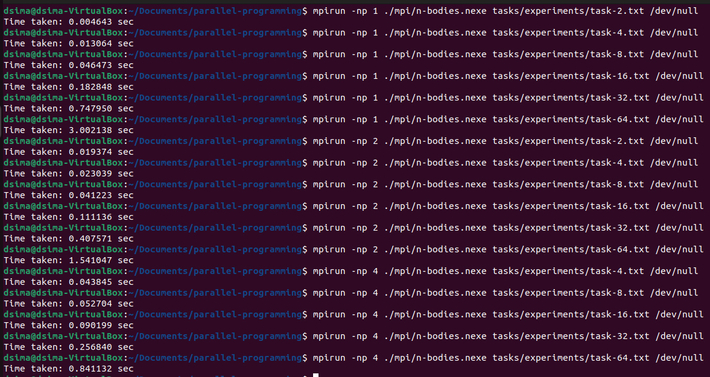

# Параллельное программирование

Здесь находятся материалы для лабораторных работ по параллелкам в ЛЭТИ.

## Постановка задачи

Все программы решают задачу `n` тел.

Формат входных файлов следующий.

```
G r dt n steps
m x y z vx vy vz	//n раз
```

где `G` -- гравитационная постоянная, `r` -- радиус тел, `n` -- их количество, `dt` -- сколько времени проходит за шаг симуляции, `steps` -- количество этих шагов, `m` -- масса тела, `x, y, z` -- его координаты, `vx, vy, vz` -- его скорость.

По окончание работы программа пишет данные о каждом симулированном теле и время своей работы.

## Компилляция и запуск

Тестовые задачи и решения для проверки их правильности расположены в `tasks/debug`.

### Последовательная программа

Для компилляции последовательной программы используется команда

`$ gcc sequential/n-bodies.c -o sequential/n-bodies.nexe -lm`

Для запуска выполнить команду

`$ ./sequential/n-bodies.nexe path/to/task.txt path/to/solution.txt`

Время работы будет выведено в `stdout`, а результат работы будет схож с тем, что находится по адресу `tasks/debug/1-step/solution.txt`.

### Open MP

Для компилляции

`$ gcc open-mp/n-bodies.c -o open-mp/n-bodies.nexe -lm -fopenmp`

Для запуска требуется сначала указать количество используемых процессов

`$ export OMP_NUM_THREADS=4`

В остальном нет отличий.

### OpenCL

Для компилляции предварительно требуется настроить поддержку OpenCL на своей машине:

```
$ sudo apt install opencl-headers ocl-icd-opencl-dev -y
$ sudo apt install libpocl2 clinfo
```

Команды выше сработали для моей виртуальной машины на Ubuntu. Для того, чтобы установить поддержку на другие машины могут подойти эти ссылки: [1](https://forums.linuxmint.com/viewtopic.php?t=362544), [2](https://github.com/KhronosGroup/OpenCL-Guide/blob/main/chapters/getting_started_linux.md).

После настройки можно приступить непосредственно к компилляции.

`$ gcc -Wall -Wextra -D CL_TARGET_OPENCL_VERSION=300 opencl/n-bodies.c -o opencl/n-bodies.nexe -lOpenCL`

Для запуска потребуется, помимо файла с задачей, указать путь к `.cl`-файлу с кодом ядра. Команда для запуска:

`$ ./opencl/n-bodies.nexe opencl/n-bodies.cl path/to/task.txt path/to/solution.txt`

### MPI

Для компилляции требуется сначала установить поддержку MPI:

`$ sudo apt install mpich`

После этого можно собрать программу.

`$ mpicc mpi/n-bodies.c -o mpi/n-bodies.nexe -lm`

Для запуска выполнить команду

`$ mpirun -np <n> ./mpi/n-bodies.nexe path/to/task.txt path/to/solution.txt`

**Ограничение:** количество процессов должно делить количество тел. 

## Результаты экспериментов

Понимаю-понимаю, но это лабораторные, отстаньте.

### Последовательная программа



### Open MP



### OpenCL



### MPI

